# SRP Demo1 — 在工作与学习中所使用和制作的各类unity效果留档

| 项 | 说明 |
|----|------|
| 工程 | SRP Demo1 |
| 版本 | 1.0.2 |
| 引擎 | Unity 2022.3.62f3 LTS |
| 管线 | URP 14.0.12，Forward |
| 范围 | 01 角色 · 02 草地 · 03 水面 / FFT 海洋 · 04 毛发 · 05 后处理 · 06 特效 · 07 PBR 物体 |
| 细则 | 各模块技术栈见 `Assets/Resources/` 下对应编号目录中的 `*_ReadMe.md`（06 为合并文档 `06.effect_ReadMe.md`） |

本工程按编号分成多套互不绑死的表现方案，共享 URP 主光、阴影和 `CBUFFER_START(UnityPerMaterial)`。用到深度写入、深度测试或颜色遮罩的 Shader，已把对应状态做成材质参数，默认值与原先硬编码一致。

```
Assets/
├── Resources/
│   ├── 00.common/Image/       # 各场景效果预览图
│   ├── 01.Character/
│   ├── 02.Grass/
│   ├── 03.water/              # Gerstner 近岸水面
│   ├── 03.gpu_FFT_Ocean/      # GPU FFT 远洋
│   ├── 04.Fur/
│   ├── 05.renderfeature/
│   ├── 06.effect/
│   └── 07.PBR_object/
└── Scenes/
```

---

## 01. 角色（`01.Character`）

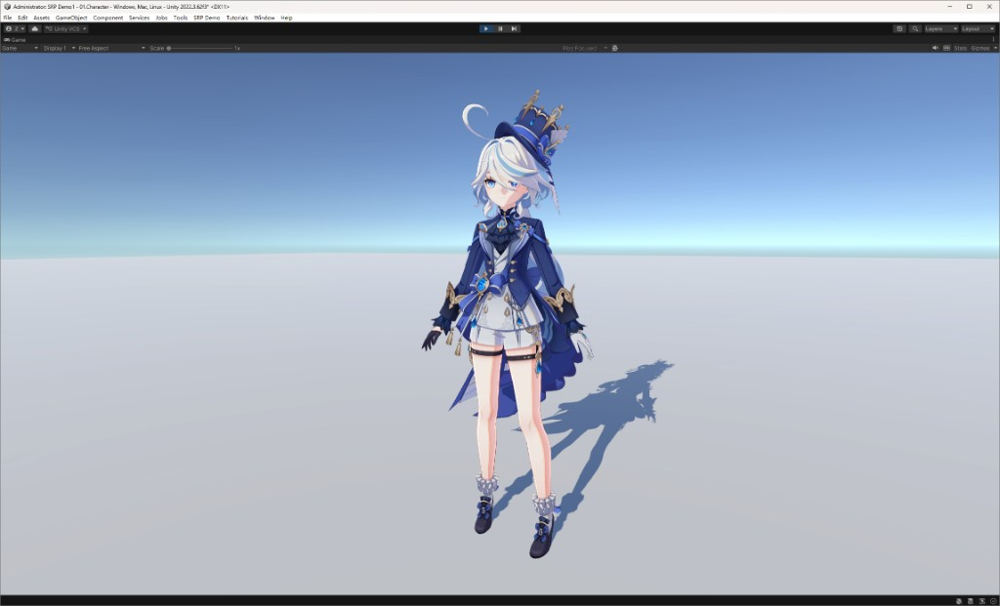

原神风格 NPR，不是能量守恒 PBR。身体用 Shadow Ramp 分层明暗，脸部用 SDF 硬边阴影，金属、高光、边缘光和自发光按贴图分区，轮廓沿法线外扩并按材质上色。正面走 UV0，背面走 UV1。

- 场景：`Assets/Scenes/01.Character.unity`
- Shader：`ZZY/01.Character/PBR`
- 细则：[01.Character_ReadMe.md](Resources/01.Character/01.Character_ReadMe.md)

## 02. 草地（`02.Grass`）

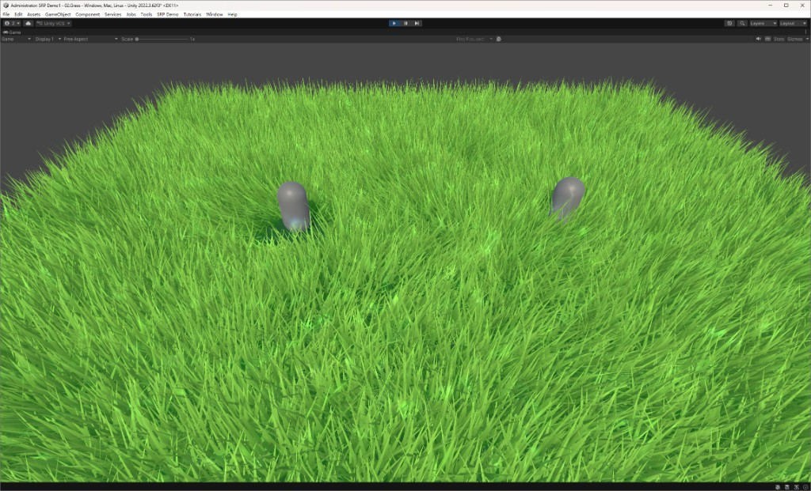

在地面网格上用曲面细分和几何着色器挤出草叶。密度、随机弯曲、风力噪声和角色压草都在 GPU 上完成，片元做根梢渐变、透光和主光阴影。

- 场景：`Assets/Scenes/02.Grass.unity`
- Shader：`ZZY/02.Grass/Grass`
- 细则：[02.Grass_ReadMe.md](Resources/02.Grass/02.Grass_ReadMe.md)

## 03. Gerstner 水面（`03.Water`）

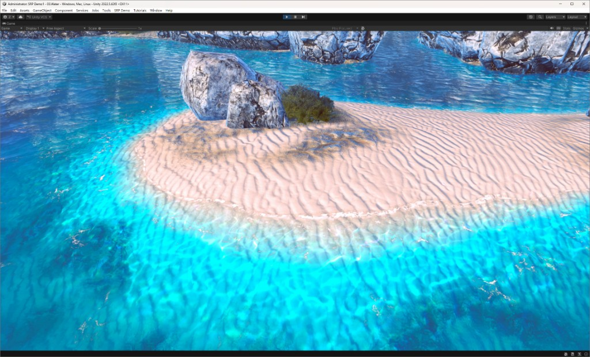

近岸海面。若干条 Gerstner 波叠加成浪，平面反射做倒影，RenderFeature 把焦散乘到水下。浅水用正交深度压低水平位移，泡沫来自浪尖、岸线和贴图。

- 场景：`Assets/Scenes/03.Water.unity`
- Shader：`ZZY/03.water/Water`、`ZZY/03.water/Caustics`、`ZZY/03.water/ProceduralSkybox`
- 细则：[03.Water_ReadMe.md](Resources/03.water/03.Water_ReadMe.md)

## 03. GPU FFT 海洋（`03.FFTOcean`）

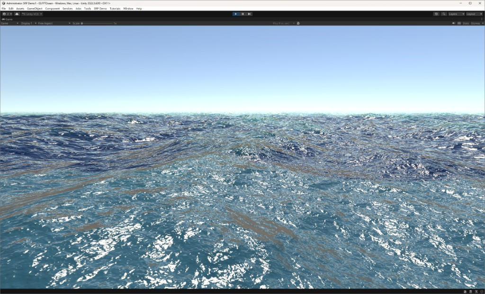

远洋谱方法海面，与上一套 Gerstner 水面独立。三频带 JONSWAP 谱经 GPU Stockham IFFT 得到位移、法线和 Jacobian 白沫，表面再做水深色、折射、菲涅尔和次表面。

- 场景：`Assets/Scenes/03.FFTOcean.unity`
- Shader：`ZZY/03.gpu_FFT_Ocean/FFTOcean`
- 细则：[03.FFTOcean_ReadMe.md](Resources/03.gpu_FFT_Ocean/03.FFTOcean_ReadMe.md)

## 04. 毛发（`04.Fur_Optimized`）

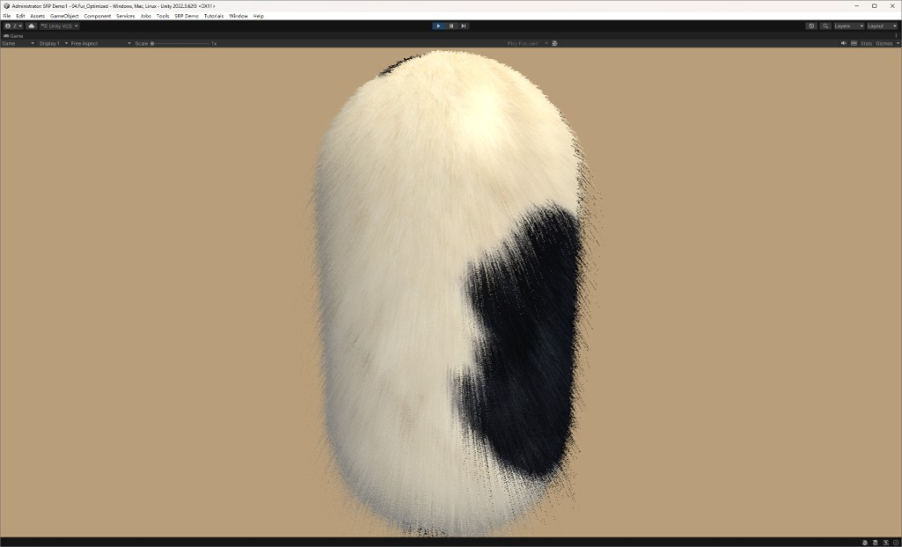

Shell Texturing 短毛。沿法线叠多层半透明壳，用噪声从根到梢镂空，重力、梳理和风力改顶点。`DrawMeshInstanced` 按距离减少层数，DepthOnly 用来挡掉多余的半透明重绘。

- 场景：`Assets/Scenes/04.Fur_Optimized.unity`
- Shader：`ZZY/04.Fur/StaticInstancedFur`
- 细则：[04.Fur_Optimized_ReadMe.md](Resources/04.Fur/04.Fur_Optimized_ReadMe.md)

## 05. 后处理（`05.PostProcessing`）

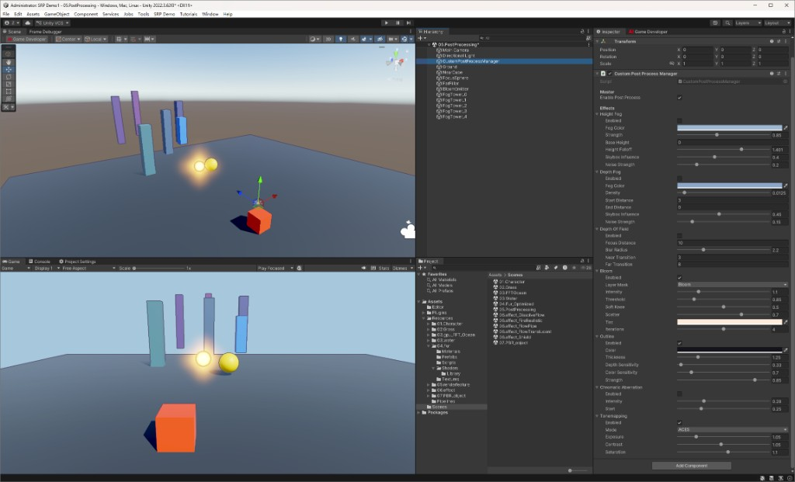

不用 URP Volume。一条 `ScriptableRendererFeature` 按固定顺序做拷贝、高度雾、深度雾、景深、按 Layer 提取的 Bloom、描边、色差和色调映射。

- 场景：`Assets/Scenes/05.PostProcessing.unity`
- 细则：[05.PostProcessing_ReadMe.md](Resources/05.renderfeature/05.PostProcessing_ReadMe.md)

## 06. 特效（`06.effect`）

五套透明特效共用 `Shaders/Library/EffectCommon.hlsl`（重映射、菲涅尔、流光 UV、溶解、深度交界、六边形 SDF、哈希噪声）。场景里不再放说明文字。

### 06. 溶解流光（`06.effect_DissolveFlow`）

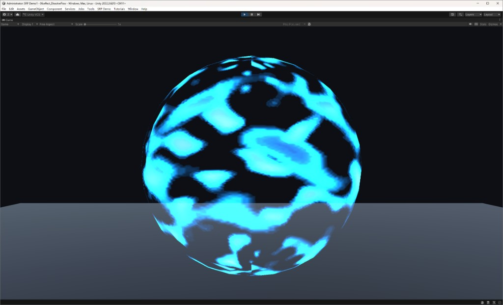

噪声阈值溶解。前沿用软透明度过渡（`smoothstep` + `fwidth`），不再硬裁切；亮边向内外衰减并带光晕，再叠一层 UV 流光，外轮廓用菲涅尔。可用 0~1 进度，也可按时间自动往复。

- 场景：`Assets/Scenes/06.effect_DissolveFlow.unity`
- Shader：`ZZY/06.effect/DissolveFlow`
- 细则：[06.effect_ReadMe.md](Resources/06.effect/06.effect_ReadMe.md)

### 06. 写实火焰（`06.effect_FireRealistic`）

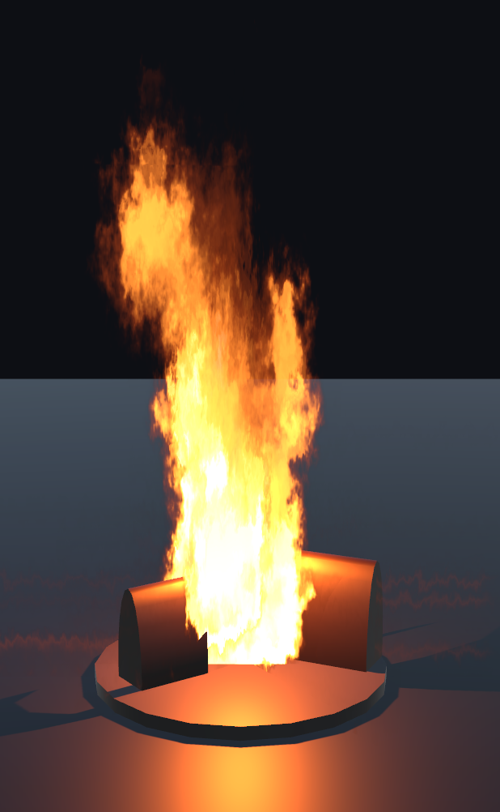

12×6 序列帧火焰。双层噪声扭曲 UV，程序噪声撕开焰尖，颜色从暗红外焰过渡到橙身和白热焰心。没有烟雾。

- 场景：`Assets/Scenes/06.effect_FireRealistic.unity`
- Shader：`ZZY/06.effect/FireRealistic`
- 细则：[06.effect_ReadMe.md](Resources/06.effect/06.effect_ReadMe.md)

### 06. 管道流水（`06.effect_FlowPipe`）

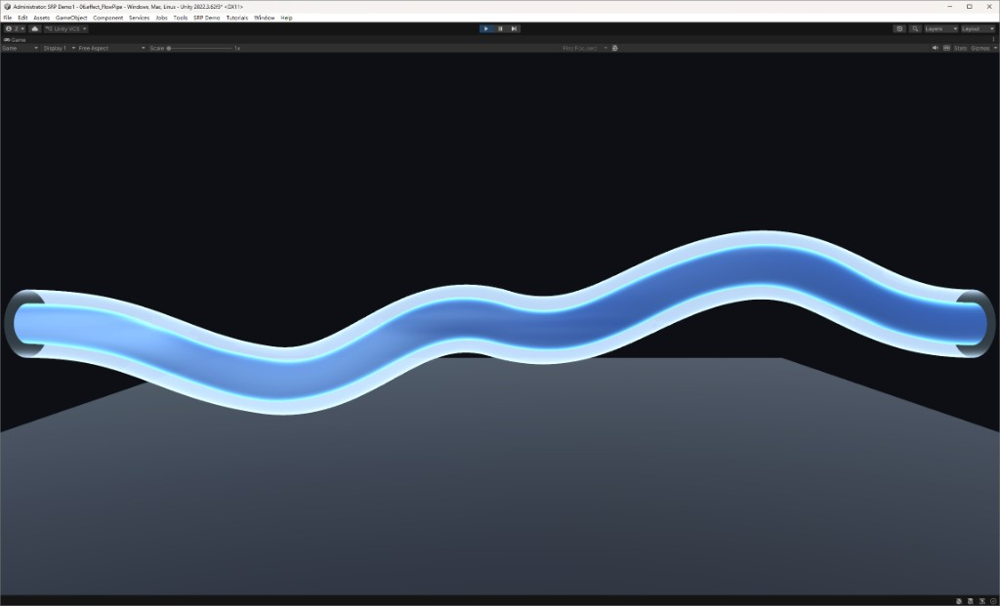

外层是低透明度玻璃壳，内层是沿管长流动的软液体。液体用两层 FBM 做亮纹，顶点有轻微径向波浪。

- 场景：`Assets/Scenes/06.effect_FlowPipe.unity`
- Shader：`ZZY/06.effect/FlowPipeGlass`、`ZZY/06.effect/FlowPipe`
- 细则：[06.effect_ReadMe.md](Resources/06.effect/06.effect_ReadMe.md)

### 06. 流光半透明（`06.effect_FlowTranslucent`）

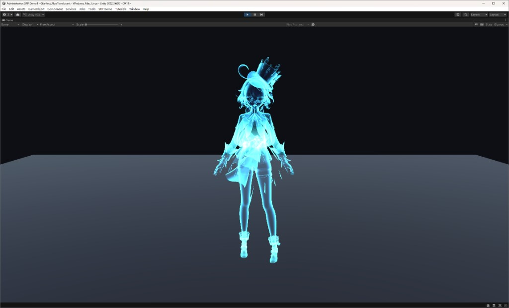

角色身上的半透明轮廓加流动亮带。流光采样用物体空间坐标，避免贴在网格 UV 接缝上。

- 场景：`Assets/Scenes/06.effect_FlowTranslucent.unity`
- Shader：`ZZY/06.effect/FlowTranslucent`
- 细则：[06.effect_ReadMe.md](Resources/06.effect/06.effect_ReadMe.md)

### 06. 能量护盾（`06.effect_Shield`）

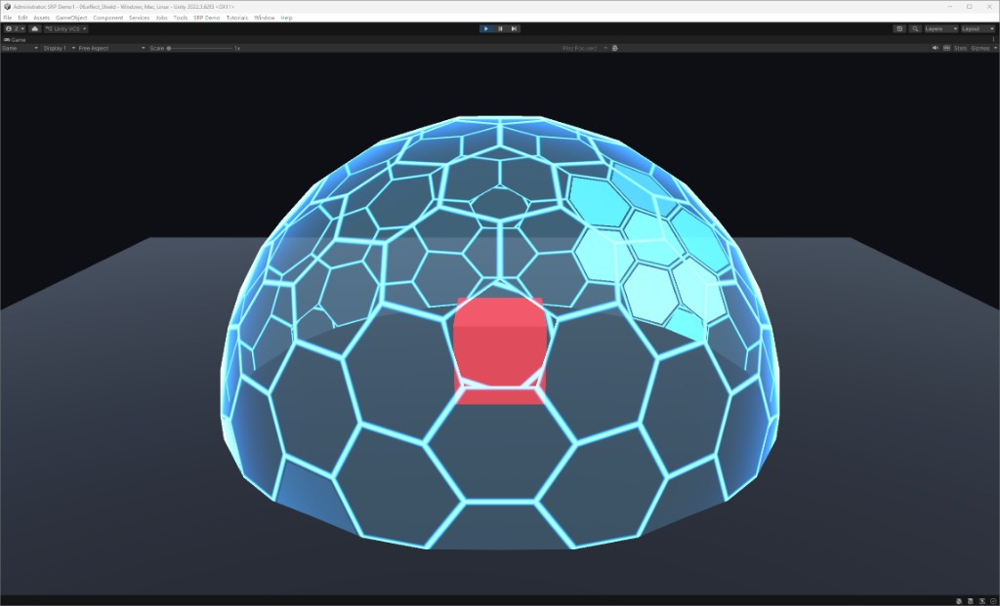

等尺寸六边形球面。罩膜在网格线下面，正反两面网格都能看见，背面略暗，正面线条不会把背面挖空。正面有剪影描边和菲涅尔边缘光，与场景物体相交处有深度亮缝。溶解用一个 0~1 参数从顶端往下把整格六边形缩小到消失。两团流光关于球心对称，沿闭合轨道游走，点亮整格而不是只点亮边线。

- 场景：`Assets/Scenes/06.effect_Shield.unity`
- Shader：`ZZY/06.effect/Shield`
- 细则：[06.effect_ReadMe.md](Resources/06.effect/06.effect_ReadMe.md)

## 07. PBR 物体（`07.PBR_object`）

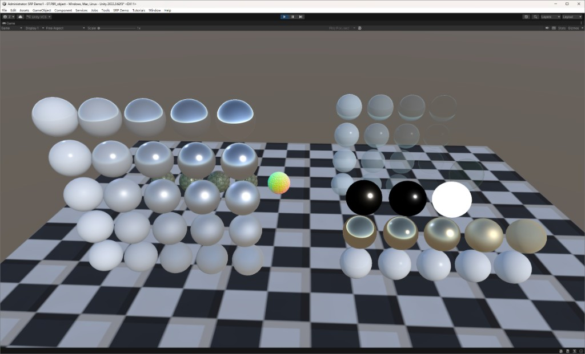

glTF 2.0 Metallic-Roughness 的 Cook-Torrance 教学场景。同一套 BRDF 上排列金属度、粗糙度、高光、法线和透射测试，透射体另走一条不写深度的折射 Pass。

- 场景：`Assets/Scenes/07.PBR_object.unity`
- Shader：`ZZY/07.PBR_object/glTFPBR`、`ZZY/07.PBR_object/glTFPBRTransmission`
- 细则：[07.PBR_object_ReadMe.md](Resources/07.PBR_object/07.PBR_object_ReadMe.md)

---

## 对照

| 编号 | 场景 | 主要阶段 | 数据从哪来 |
|------|------|----------|------------|
| 01 | `01.Character` | 多 Pass 顶点 / 片元 | Diffuse、Ramp、Lightmap |
| 02 | `02.Grass` | 细分 + 几何着色器 | 程序化草叶、风力贴图 |
| 03 | `03.Water` | 顶点位移 + 反射相机 | Gerstner 波列、水深 |
| 03 | `03.FFTOcean` | Compute + 顶点 / 片元 | 频谱贴图 |
| 04 | `04.Fur_Optimized` | Instancing 多层壳 | 噪声、长度 |
| 05 | `05.PostProcessing` | 全屏 Pass | 颜色和深度 |
| 06 | 五套特效场景 | 透明片元，护盾双 Pass | 噪声、序列帧、六边形 SDF、场景深度 |
| 07 | `07.PBR_object` | Forward + 透射 Pass | glTF 贴图通道 |
